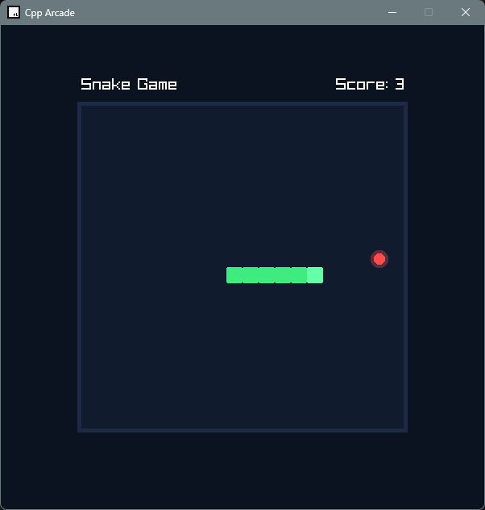
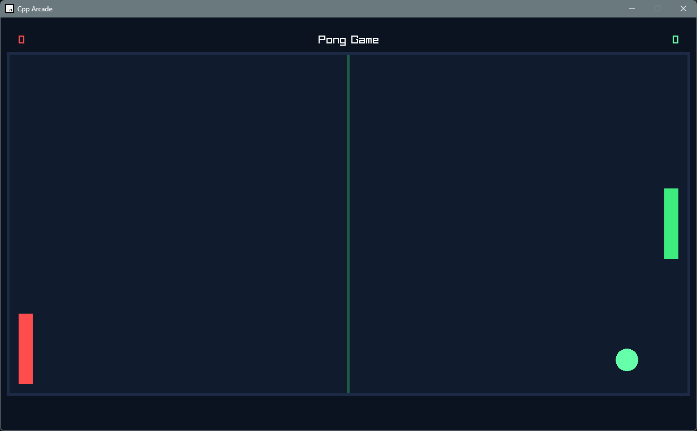
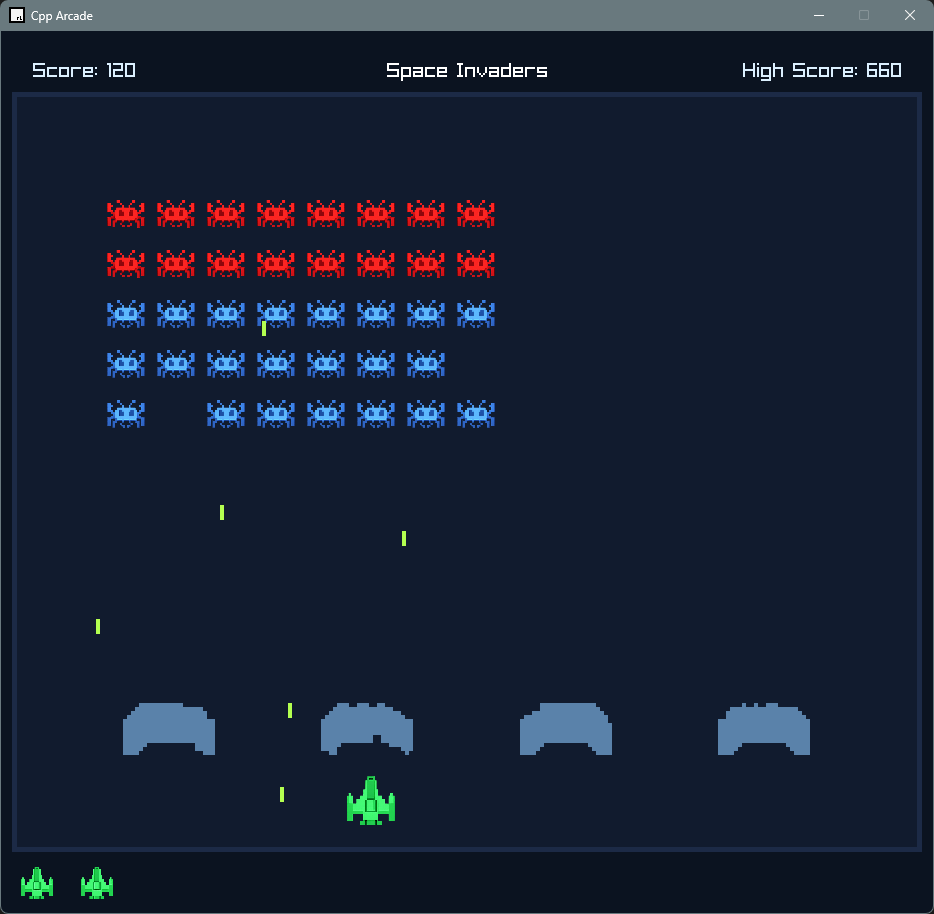
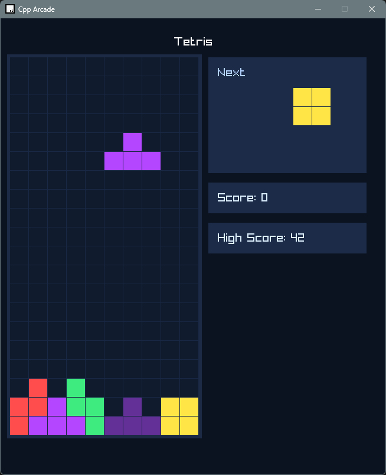

# Cpp Arcade

A collection of classic arcade games built in **modern C++** using **Raylib**, created as a hands-on journey into game development, software architecture, and performance-oriented programming.

The project currently includes:

- 🐍 Snake
- 🏓 Pong
- 👾 Space Invaders
- 🧩 Tetris

What started as a way to learn pure C++ game development has gradually evolved into a reusable game framework. Common systems are shared across games, and the project is being refactored toward a component-based architecture that will support larger and more complex games in the future.

---

## Demo

| Snake | Pong |
|-------|------|
|  |  |

| Space Invaders | Tetris |
|-------|------|
|  |  |

---

## Technologies

- **C++17**
- **Raylib**
- Visual Studio

---

## Learning Objectives

This project was created to explore:

- Game programming fundamentals
- Real-time update loops
- Collision systems
- Input processing
- Rendering pipelines
- Memory management in C++
- Software architecture for games
- Reusable engine design
- Performance optimization techniques

---

## Future Development

The next major milestone is transforming the current shared framework into a more scalable **Entity Component System (ECS)** architecture.

Planned improvements include:

- Entity Component System (ECS)
- Event messaging system
- Data-driven game objects
- Animation system
- Particle effects
- Audio manager
- Save/load system
- Object pooling
- Performance profiling tools
- Serialization support
- Editor/debug tools

---

## License

This project is licensed under the MIT License.

---

## Author

Developed by **Sarah Chun**